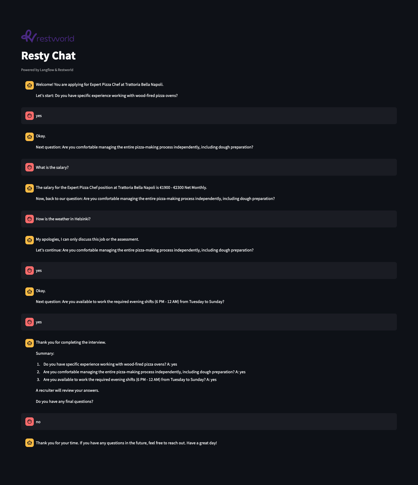
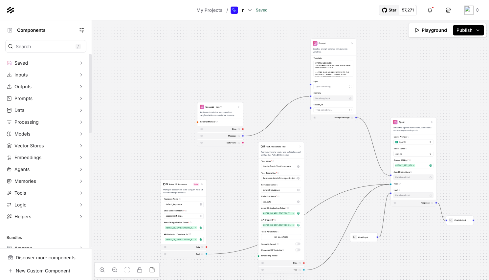

# Resty - AI Pre-Assessment Chatbot (Langflow + Astra DB)

This project demonstrates an AI-powered chatbot named "Resty" designed to conduct structured pre-assessment interviews for job applicants. It leverages Langflow for orchestrating the AI agent and tool interactions, Streamlit for the user interface, and Astra DB for persistent session state management.


*Chat UI showing assessment, clarification, and summary steps.*

## Overview

Resty simulates a preliminary screening call. A candidate selects a specific Job ID, and the chatbot guides them through a predefined set of assessment questions associated with that job (`sample_job_data_en.json`). The chatbot can also handle candidate questions about the job details (salary, location, etc.) using the `GetJobDetailsToolComponent` and gracefully manage off-topic inquiries while maintaining the assessment flow using the custom `AstraDBAssessmentStateManagerTool`. Upon completion, it provides a summary of the candidate's answers.

The core logic relies heavily on the **Agent Prompt** within Langflow, which dictates the step-by-step procedure the LLM must follow, including strict rules about using tools correctly and composing clean output messages. State persistence across turns is handled by storing session data in **Astra DB**, keyed by a unique session ID.

## Key Features

*   **Job-Specific Assessments:** Loads interview questions dynamically based on the selected Job ID.
*   **Structured Question Flow:** Follows a predefined sequence of assessment questions.
*   **Clarification Handling:** Can answer candidate questions about the job using a dedicated tool.
*   **Robust State Management:** Uses Astra DB (`AstraDBAssessmentStateManagerTool`) to persist the interview state (current question index, collected answers, completion status) for each unique session.
*   **Off-Topic Handling:** Redirects users politely if they ask questions outside the scope of the job or assessment.
*   **Final Summary:** Provides a summary of the assessment questions and answers upon completion.
*   **Simple Web Interface:** Built with Streamlit (`resty_chat_app.py`).
*   **LLM Orchestration:** Uses Langflow (`resty job assessment.json`) to visually design and manage the agent, prompts, and tool integrations.

## Technology Stack

*   **Python 3.9+**
*   **Langflow:** For AI agent orchestration (running via Docker recommended).
*   **Langchain:** Underlying framework used by Langflow and custom components.
*   **Streamlit:** For the chat web interface.
*   **Astra DB:** Serverless Cassandra database for persistent state management (via `astrapy`).
*   **OpenAI API (or compatible LLM):** Used by the Langflow Agent component (configured with GPT-4o during development).
*   **Docker & Docker Compose:** For running Langflow and its dependencies easily.

## Flow Diagram

*(Illustrates the high-level interaction between Langflow components)*



## Project Structure

```text
.
├── assets/
│   ├── langflow.png         # Screenshot of the Langflow graph
│   └── chat.png             # Screenshot of the Streamlit chat UI
├── langflow_export/
│   └── resty job assessment.json # Exported flow from Langflow UI
├── langflow_components/
│   └── helpers/
│       └── astra_assessment_state_manager_tool.py # Astra DB state tool
├── .env.example             # Example environment variables
├── .gitignore               # Git ignore rules
├── README.md                # This file
├── requirements.txt         # Streamlit App requirements
├── resty_chat_app.py        # Streamlit App
└── sample_job_data_en.json  # Sample Job Data
```

## Setup Instructions

**1. Prerequisites:**

*   Python 3.9 or later installed.
*   `pip` (Python package installer).
*   Docker and Docker Compose installed.
*   An Astra DB account (a free tier is available).
*   An OpenAI API Key (or API key for your chosen LLM provider compatible with Langflow).

**2. Clone Repository:**

```bash
git clone https://github.com/your-username/resty-langflow-astra-chatbot.git # Replace with your repo URL
cd resty-langflow-astra-chatbot
```

**3. Astra DB Setup:**

*   Log in to your [DataStax Astra](https://astra.datastax.com/) account.
*   Create a new **Serverless Database**.
*   Note down your **Database API Endpoint** and select/create a **Keyspace Name** (e.g., `default_keyspace`).
*   Generate an **Application Token** with appropriate permissions (e.g., "Database Administrator" or custom roles allowing read/write to collections). Note the Token value (it starts with `AstraCS:...`).
*   You do *not* need to manually create the state collection (e.g., `assessment_state`); the state manager tool will create it on first use if it doesn't exist.

**4. Environment Variables:**

*   Create a file named `.env` in the project root directory.
*   Add the following lines, replacing the placeholder values with your actual credentials:

```dotenv
# .env file
ASTRA_DB_APPLICATION_TOKEN="AstraCS:..."
ASTRA_DB_API_ENDPOINT="YOUR_DATABASE_ID_OR_API_ENDPOINT" # e.g., a8e9a7e...
OPENAI_API_KEY="sk-..."
ASTRA_DB_COLLECTION_NAME="your_state_collection"
```

**5. Langflow Setup (Docker Recommended):**

*   **Run Langflow:** Use Docker Compose for ease. Refer to the [Langflow Documentation](https://docs.langflow.org/getting-started/docker) for setup guides.
*   **Custom Component Handling:** The code for the custom `AstraDBAssessmentStateManagerTool` (`langflow_components/helpers/astra_assessment_state_manager_tool.py`) is included in this repository for reference and development. When you import the flow (`langflow_export/resty job assessment.json`) into Langflow, the Python code for this component is embedded within the flow's JSON definition. Therefore, you **do not** typically need to manually mount this file into the Docker container for the *imported flow to work*. Mounting is primarily useful if you are actively developing the component and want Langflow to pick up changes without re-importing the flow.
    ```yaml
    # Example docker-compose.yml service definition for DEVELOPMENT (if modifying the component)
    # services:
    #   langflow:
    #     # ... other config ...
    #     volumes:
    #       # Mounts the local components dir into the container to override embedded code
    #       - ./langflow_components:/app/langflow/custom_components # ADJUST TARGET PATH AS NEEDED
    #     environment:
    #       # ... env vars for credentials ...
    ```
*   **Install Dependencies:** Ensure `astrapy` is installed *within* the Langflow Docker container environment (e.g., by customizing the Dockerfile or exec-ing into the running container and running `pip install astrapy`).
*   **Access Langflow:** Open your browser to `http://localhost:7860` (or the configured port).

**6. Import and Configure Langflow Flow:**

*   In the Langflow UI, import the flow from `langflow_export/resty job assessment.json`.
*   Examine the imported flow:
    *   Verify the `Astra DB Assessment State Manager` component is present.
    *   Configure its inputs: Ensure Keyspace, Collection Name, Token, and API Endpoint point to your Astra DB setup (use placeholders like `{ASTRA_DB_APPLICATION_TOKEN}` to read from environment variables set in Docker Compose).
    *   Configure the `Agent` component: Ensure it's using your desired LLM (e.g., `gpt-4o`) and API key (`{OPENAI_API_KEY}`). Verify the **prompt** contains the final working version (e.g., V15/V16) and references the state tool name `manage_assessment_state_astra_v1`.
    *   Configure the `GetJobDetailsToolComponent`: Update its inputs if necessary (e.g., Tool Parameters `job_id`, Astra connection if applicable).
*   Save the flow in Langflow. Note its **Flow ID** (e.g., `3cc6edb3-...`).

**7. Setup Streamlit App:**

*   **Install dependencies:** Ensure you have Python 3.9+ installed locally (Python 3.12.9 used during development). Install the required packages:
    ```bash
    pip install -r requirements.txt
    ```

**8. Configure Streamlit App:**

*   Open `resty_chat_app.py`.
*   Update the `FLOW_ID` variable near the top to match the ID of your saved Langflow flow.
*   Ensure `LANGFLOW_BASE_URL` points to your running Langflow instance.

## Running the Application

1.  Ensure Langflow is running via Docker (`docker-compose up -d`).
2.  Ensure your `.env` file is present and contains the correct credentials.
3.  Run the Streamlit app:
    ```bash
    streamlit run resty_chat_app.py
    ```
4.  Open your browser to the local URL provided by Streamlit (usually `http://localhost:8501`).
5.  Select a Job ID and interact with Resty! Check the Langflow Docker logs and your Astra DB collection to monitor interactions.

## State Management Explanation

The key to handling the conversation flow correctly across multiple turns, especially when interruptions like clarification questions occur, is the state management performed by the `AstraDBAssessmentStateManagerTool` component:

1.  **Initialization:** When the chat starts, the `INITIALIZE_WITH_QUESTIONS` action is called. This creates a new document in the specified Astra DB collection (`assessment_state` by default). The document's `_id` is the unique `session_id` for the chat. This document stores the list of `job_questions`, sets `current_question_index` to 0, `collected_answers` to empty, and `assessment_complete` to `false`.
2.  **Recording Answers:** When the user provides a valid answer to an assessment question, the `RECORD_ANSWER_AND_GET_NEXT` action is called. The tool retrieves the current state document from Astra DB, adds the answer to the `collected_answers` map (keyed by the index), increments the `current_question_index`, checks if the assessment is now complete, and saves the *entire updated state document* back to Astra DB, replacing the previous version. It returns the next question text or the `[ASSESSMENT_COMPLETE]` signal.
3.  **Getting Current Question:** When the user asks a clarification or irrelevant question, the `GET_CURRENT_QUESTION` action is called. The tool retrieves the current state document from Astra DB and returns the text of the question at the `current_question_index` *without modifying the state*. This allows the Agent to re-ask the correct pending question.
4.  **Persistence:** By storing this state in Astra DB, the application becomes stateless itself. Each request is handled based on the persistent state retrieved for that specific session.

## Considerations & Future Enhancements

*   **Agent Reliability:** The biggest challenge is ensuring the LLM Agent strictly follows the prompt, especially the rule about not outputting raw tool results. Further prompt tuning or exploring different Agent configurations/models might be needed for production robustness.
*   **Astra DB Indexing:** For a high volume of sessions, consider if specific queries on the state data might be needed and add appropriate indexes in Astra DB (though simple `_id` lookups are efficient).
*   **Centralize Summary Generation:** Modify `astra_assessment_state_manager_tool.py` to generate the summary itself upon completion, simplifying the Agent's final step.
*   **(See previous README draft for more enhancement ideas)**
